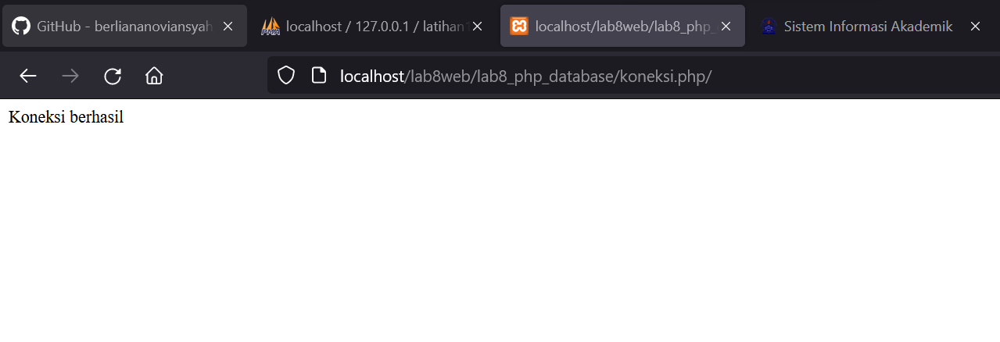

|  Berliana Noviansyah  |   312010373   |
|-----------------------|---------------|
|    Pemrograman Web    |    TI.20.A1   |
|     Pertemuan 10      |  Praktikum 8  |


# Praktikum 8 Pertemuan 10


## 1). Menjalankan MySql Server


Menjalankan Mysql server melalui Xampp Control.


## 2). Membuat Database

```sql
CREATE DATABASE latihan1;
```


## 3). Membuat Tabel


```sql
CREATE TABLE data_barang (
id_barang int(10) auto_increment Primary Key,
kategori varchar(30),
nama varchar(30),
gambar varchar(100),
harga_beli decimal(10,0),
harga_jual decimal(10,0),
stok int(4)
);
```


## 4). Menambahkan Data

```sql
INSERT INTO data_barang (kategori, nama, gambar, harga_beli, harga_jual, stok)
VALUES ('Elektronik', 'HP Samsung Android', 'hp_samsung.jpg', 2000000, 2400000, 5),
('Elektronik', 'HP Xiaomi Android', 'hp_xiaomi.jpg', 1000000, 1400000, 5),
('Elektronik', 'HP OPPO Android', 'hp_oppo.jpg', 1800000, 2300000, 5);
```


## 5). Membuat Program CRUD


Lalu untuk mengaksesnya, masukan URL berikut: http://localhost/lab8web/lab8_php_database/

\


## 6). Membuat File Koneksi Database


```sql
<?php
$host = "localhost";
$user = "root";
$pass = "";
$db = "latihan1";
$conn = mysqli_connect($host, $user, $pass, $db);
if ($conn == false)
{
echo "Koneksi ke server gagal.";
die();
} else echo "Koneksi berhasil";
?>
```





## 7). Membuat File Index Untuk Menampilkan Data (*read*)


```sql
<?php
include("koneksi.php");

// query untuk menampilkan data
$sql = 'SELECT * FROM data_barang';
$result = mysqli_query($conn, $sql);

?>
<!DOCTYPE html>
<html lang="en">
<head>
    <meta charset="UTF-8">
    <meta http-equiv="X-UA-Compatible" content="IE=edge">
    <meta name="viewport" content="width=device-width, initial-scale=1.0">
    <title>Data Barang</title>
    <link rel="stylesheet" href="style.css">
</head>
<body>
    <div class="container">
        <h1>Data Barang</h1>
        <div class="main">
            <a href="tambah.php">Tambah Barang</a>
            <table>
                <tr>
                    <th>Gambar</th>
                    <th>Nama Barang</th>
                    <th>Kategori</th>
                    <th>Harga Jual</th>
                    <th>Harga Beli</th>
                    <th>Stok</th>
                    <th>Aksi</th>
                </tr>
            <?php if($result): ?>
            <?php while($row = mysqli_fetch_array($result)): ?> 
                <tr>
                    <td>" alt="<?=
$row['nama'];?>"></td>
                    <td><?= $row['nama'];?></td>
                    <td><?= $row['kategori'];?></td>
                    <td><?= $row['harga_beli'];?></td>
                    <td><?= $row['harga_jual'];?></td>
                    <td><?= $row['stok'];?></td>
                    <td>
                    <a href="ubah.php?id=<?= $row['id_barang'];?>">Ubah</a>
                    <a href="hapus.php?id=<?= $row['id_barang'];?>">Hapus</a> 
                    </td>
                </tr>
                <?php endwhile; else: ?>
                 <tr>
                 <td colspan="7">Belum ada data</td>
                 </tr>
                 <?php endif; ?>  
             </table> 
        </div>
    </div>
</body>
</html>
```


## 8). Menambahkan Data

```sql
<?php
error_reporting(E_ALL);
include_once 'koneksi.php';

if (isset($_POST['submit']))
{
    $nama = $_POST['nama'];
    $kategori = $_POST['kategori'];
    $harga_jual = $_POST['harga_jual'];
    $harga_beli = $_POST['harga_beli'];
    $stok = $_POST['stok'];
    $file_gambar = $_FILES['file_gambar'];
    $gambar = null;
    if ($file_gambar['error'] == 0)
    {
        $filename = str_replace(' ', '_',$file_gambar['name']);
        $destination = dirname(__FILE__) .'/gambar/' . $filename;
        if(move_uploaded_file($file_gambar['tmp_name'], $destination))
        {
            $gambar = 'gambar/' . $filename;;
        }
    }
    $sql = 'INSERT INTO data_barang (nama, kategori,harga_jual, harga_beli,
    stok, gambar) ';
    $sql .= "VALUE ('{$nama}', '{$kategori}','{$harga_jual}',
    '{$harga_beli}', '{$stok}', '{$gambar}')";
         $result = mysqli_query($conn, $sql);
         header('location: index.php'); 
}
?>
<!DOCTYPE html>
<html lang="en">
<head>
    <meta charset="UTF-8">
    <meta http-equiv="X-UA-Compatible" content="IE=edge">
    <meta name="viewport" content="width=device-width, initial-scale=1.0">
    <title>Tambah Barang</title>
    <link rel="stylesheet" href="style.css">
</head>
<body>
    <div class="container">
        <h1>Tambah Barang</h1>
        <div class="main">
            <form method="post" action="tambah.php"
enctype="multipart/form-data">
                <div class="input">
                    <label> Nama Barang</label>
                    <input type="text" name="nama"/>
                </div>
                <div class="input">
                    <label>Kategori</label>
                    <select name="kategori">
                        <option value="Komputer">Komputer</option>
                        <option value="Elektronik">Elektronik</option>
                        <option value="HandPhone">HandPhone</option>
                    </select>
                </div>
                <div class="input">
                    <label>Harga Jual</label>
                    <input type="text" name="harga_jual" />
                </div>
                <div class="input">
                    <label>Harga Beli</label>
                    <input type="text" name="harga_beli" />
                </div>
                <div class="input">
                    <label>Stok</label>
                    <input type="text" name="stok" />
                </div>
                <div class="input">
                    <label>File Gambar</label>
                    <input type="file" name="file_gambar" />
                </div>
                <div class="submit">
                    <input type="submit" name="submit" value="Simpan" />
                </div>
            </form>
        </div>
    </div>
</body>
</html>
```


